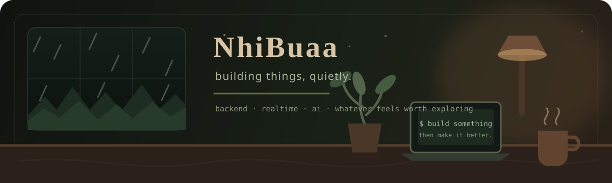
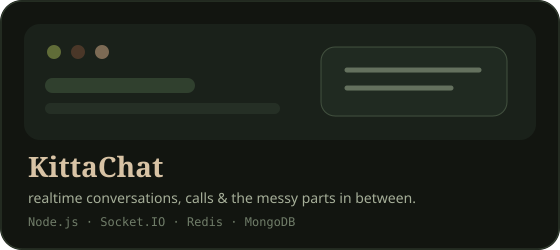
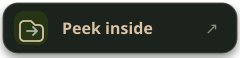
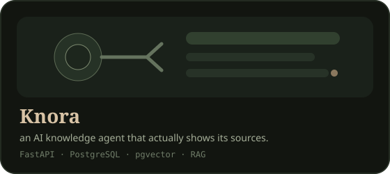
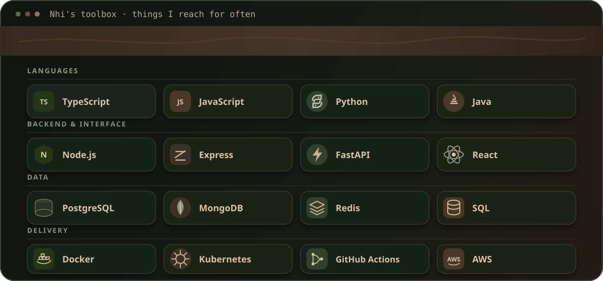
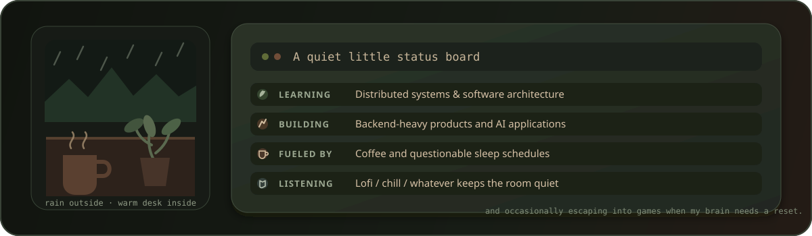
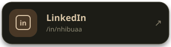

  

  Software Engineering student · Ho Chi Minh City

## About me

Hey, I'm Nhi.

I like building software, drinking coffee, listening to chill music, and spending way too much time figuring out why something that worked yesterday suddenly doesn't work today.

Most days I'm somewhere between **backend systems**, **realtime apps**, **AI agents**, and whatever feels interesting enough to explore next.

> Build it → break it → understand it → make it better.

## Things I'm building

<table>
  <tr>
    <td width="50%" valign="top">
      
       
      
        A full-stack realtime communication platform where I've been exploring reliable message delivery, distributed coordination, idempotency and WebRTC.
      
        
      

        
        
      

    </td>
    <td width="50%" valign="top">
      
       
      
        An AI support and knowledge agent for uploaded documents, with cited answers, workspace isolation, ingestion pipelines and evaluation traces.
      
        
      

        
      

    </td>
  </tr>
</table>

## My little toolbox

  

## Currently wandering around

  

## Find me elsewhere

<table>
  <tr>
    <td width="33.33%" align="center">
      
    </td>
    <td width="33.33%" align="center">
      
    </td>
    <td width="33.33%" align="center">
      
    </td>
  </tr>
</table>

 

  🌿 Thanks for wandering by — see you around.

